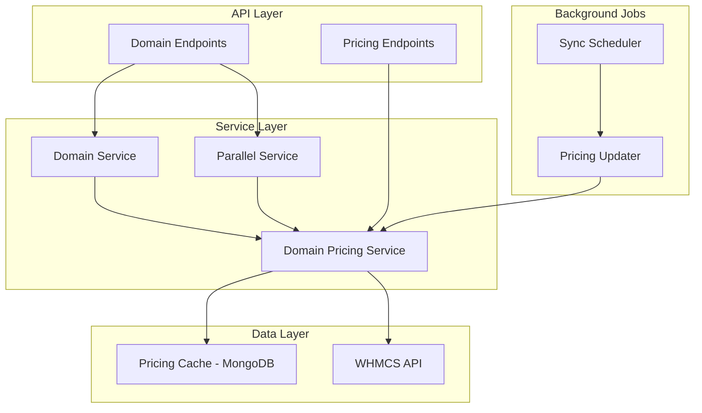
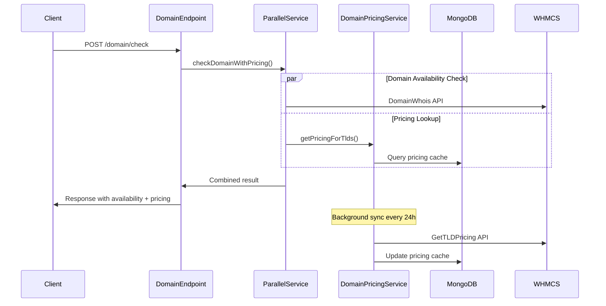

# Design Document

## Overview

This design enhances the existing WHMCS domain pricing integration by implementing a robust pricing synchronization system with parallel price checking capabilities. The system builds upon the current architecture that already includes TLD pricing storage in MongoDB and basic WHMCS API integration.

The design focuses on:
- Separating pricing synchronization from domain availability checks
- Implementing parallel price fetching for domain endpoints
- Enhancing the existing TLD pricing service with better error handling and scheduling
- Maintaining backward compatibility with existing domain endpoints

## Architecture

### High-Level Architecture


###
 Component Interaction Flow



## Components and Interfaces

### 1. Enhanced Domain Pricing Service

**Location**: `src/services/domainPricingService.js` (enhanced version of existing `tldPricing.js`)

**Responsibilities**:
- Fetch TLD pricing from WHMCS GetTLDPricing action
- Manage pricing cache in MongoDB with staleness detection
- Handle currency conversion (USD to PKR)
- Provide pricing lookup for multiple TLDs in parallel
- Schedule and execute background pricing updates

**Key Methods**:
```javascript
class DomainPricingService {
  // Enhanced from existing tldPricing.js
  async fetchAndUpdatePricing()
  async getPricingForTlds(tlds) // New: parallel lookup
  async schedulePeriodicSync()
  async validatePricingFreshness()
  
  // Health and monitoring
  async getPricingHealth()
  async getLastSyncStatus()
}
```#
## 2. Parallel Processing Service

**Location**: `src/services/parallelService.js` (new)

**Responsibilities**:
- Coordinate parallel execution of domain availability and pricing checks
- Manage concurrency limits and rate limiting
- Aggregate results from multiple async operations

**Key Methods**:
```javascript
class ParallelService {
  async checkDomainWithPricing(domain)
  async checkMultipleDomainsWithPricing(domains)
  async batchPricingLookup(tlds)
}
```

### 3. Enhanced Domain Service

**Location**: `src/services/domainService.js` (enhanced existing)

**Responsibilities**:
- Integrate with ParallelService for combined availability + pricing checks
- Maintain existing domain availability functionality
- Provide backward compatibility

**Enhanced Methods**:
```javascript
// Enhanced existing methods
async getDomainAvailability(domain) // Now includes parallel pricing
async checkMultipleDomains(domains) // Enhanced with pricing
```

### 4. Background Sync Scheduler

**Location**: `src/services/syncScheduler.js` (enhanced from existing server.js logic)

**Responsibilities**:
- Schedule periodic TLD pricing updates
- Handle sync failures and retries
- Provide manual sync triggers

### 5. Enhanced Domain Controller

**Location**: `src/controllers/domain.js` (enhanced existing)

**Responsibilities**:
- Handle domain availability requests with integrated pricing
- Maintain existing API contract while adding pricing data
- Provide new pricing-specific endpoints## Data
 Models

### Enhanced TLD Pricing Model

**Location**: `src/models/TldPricing.js` (enhanced existing)

```javascript
const TldPricingSchema = new mongoose.Schema({
  // Existing fields
  tld: { type: String, required: true, index: true, unique: true },
  categories: { type: [String], default: [] },
  addons: { /* existing structure */ },
  group: { type: String, default: '' },
  register: { type: Object, default: {} },
  transfer: { type: Object, default: {} },
  renew: { type: Object, default: {} },
  grace_period: { type: Object, default: {} },
  redemption_period: { type: Object, default: {} },
  exchange_rate: { type: Number, default: null },
  exchange_rate_date: { type: Date, default: null },
  raw: { type: Object, default: {} },
  
  // Enhanced fields for better tracking
  last_sync_date: { type: Date, default: Date.now },
  sync_status: { 
    type: String, 
    enum: ['fresh', 'stale', 'failed'], 
    default: 'fresh' 
  },
  sync_attempts: { type: Number, default: 0 },
  last_error: { type: String, default: null }
}, { timestamps: true });

// Enhanced indexes for performance
TldPricingSchema.index({ last_sync_date: 1 });
TldPricingSchema.index({ sync_status: 1 });
```

### Pricing Sync Log Model

**Location**: `src/models/PricingSyncLog.js` (new)

```javascript
const PricingSyncLogSchema = new mongoose.Schema({
  sync_id: { type: String, required: true, unique: true },
  start_time: { type: Date, required: true },
  end_time: { type: Date },
  status: { 
    type: String, 
    enum: ['running', 'completed', 'failed'], 
    default: 'running' 
  },
  tlds_processed: { type: Number, default: 0 },
  tlds_updated: { type: Number, default: 0 },
  tlds_failed: { type: Number, default: 0 },
  exchange_rate: { type: Number },
  errors: [{ 
    tld: String, 
    error: String, 
    timestamp: Date 
  }],
  performance_metrics: {
    api_response_time: Number,
    db_write_time: Number,
    total_duration: Number
  }
}, { timestamps: true });
```## Error Ha
ndling

### 1. WHMCS API Error Handling

```javascript
class WHMCSApiError extends Error {
  constructor(message, action, params, response) {
    super(message);
    this.name = 'WHMCSApiError';
    this.action = action;
    this.params = params;
    this.response = response;
  }
}

// Retry strategy with exponential backoff
const retryConfig = {
  maxRetries: 3,
  baseDelay: 1000,
  maxDelay: 10000,
  backoffFactor: 2
};
```

### 2. Database Error Handling

```javascript
class PricingCacheError extends Error {
  constructor(message, operation, tld) {
    super(message);
    this.name = 'PricingCacheError';
    this.operation = operation;
    this.tld = tld;
  }
}

// Graceful degradation strategy
async function getPricingWithFallback(tld) {
  try {
    return await getPricingFromCache(tld);
  } catch (error) {
    logger.warn(`Cache miss for ${tld}, falling back to WHMCS API`);
    return await fetchPricingFromWHMCS(tld);
  }
}
```

### 3. Parallel Processing Error Handling

```javascript
// Fail-fast vs fail-safe strategies
const parallelConfig = {
  concurrency: 5,
  timeout: 5000,
  failureThreshold: 0.3, // 30% failure rate triggers circuit breaker
  circuitBreakerTimeout: 60000
};
```## 
Testing Strategy

### 1. Unit Tests

**Location**: `src/services/*.test.js`

**Coverage Areas**:
- DomainPricingService methods with mocked WHMCS API
- ParallelService concurrency and error handling
- Currency conversion accuracy
- Data validation and sanitization

**Key Test Cases**:
```javascript
describe('DomainPricingService', () => {
  test('should fetch and convert USD to PKR pricing');
  test('should handle WHMCS API failures gracefully');
  test('should detect and refresh stale pricing data');
  test('should validate pricing data structure');
});

describe('ParallelService', () => {
  test('should process multiple domains concurrently');
  test('should respect concurrency limits');
  test('should handle partial failures in batch operations');
});
```

### 2. Integration Tests

**Location**: `src/test/integration/`

**Coverage Areas**:
- End-to-end domain availability + pricing flow
- Database operations with real MongoDB instance
- WHMCS API integration (with test credentials)
- Background sync job execution

### 3. Performance Tests

**Location**: `src/test/performance/`

**Coverage Areas**:
- Parallel processing performance under load
- Database query optimization validation
- Memory usage during bulk operations
- API response time benchmarks

**Performance Targets**:
- Domain endpoint response time: < 3 seconds
- Parallel pricing lookup: < 1 second for 10 TLDs
- Background sync: Complete within 5 minutes for 500+ TLDs
- Memory usage: < 100MB during normal operations

### 4. Monitoring and Health Checks

**Health Check Endpoints**:
```javascript
// GET /api/health/pricing
{
  "status": "healthy",
  "last_sync": "2024-01-15T10:30:00Z",
  "stale_tlds": 0,
  "total_tlds": 450,
  "exchange_rate_age": "2 hours",
  "cache_hit_rate": 0.95
}

// GET /api/health/pricing/detailed
{
  "sync_history": [...],
  "error_summary": {...},
  "performance_metrics": {...}
}
```

**Logging Strategy**:
- Structured JSON logging with correlation IDs
- Performance metrics for all external API calls
- Error tracking with context and stack traces
- Audit trail for pricing updates and sync operations