# WordPress Diagnose Endpoint - Complete Flow Diagram

## Overview
The WordPress diagnose endpoint (`/wordpress/diagnose`) implements a comprehensive 4-step diagnostic workflow to analyze WordPress database connectivity issues.

## Complete Flow Diagram

```mermaid
flowchart TD
    Start([POST /wordpress/diagnose]) --> ValidateInput{Validate Input Parameters}
    
    ValidateInput -->|Invalid| ReturnError[Return Validation Error]
    ValidateInput -->|Valid| InitWorkflow[Initialize Workflow Result]
    
    InitWorkflow --> StepA[Step A: Quick Guards]
    
    %% Step A: Quick Guards
    StepA --> CheckSkipGuards{skipGuards = true?}
    CheckSkipGuards -->|Yes| SkipGuards[Skip Guards - Mark as Skipped]
    CheckSkipGuards -->|No| RunGuards[Run Guard Checks]
    
    RunGuards --> ServiceCheck[A1: Check WHMCS Service State]
    ServiceCheck --> ServiceResult{Service Active?}
    ServiceResult -->|No| ServiceEscalation[Escalate to Billing]
    ServiceResult -->|Yes| DNSCheck[A2: Check DNS Resolution]
    
    DNSCheck --> DNSResult{DNS Resolves?}
    DNSResult -->|No| DNSEscalation[Escalate - DNS Misconfigured]
    DNSResult -->|Yes| GuardsComplete[Guards Complete]
    
    SkipGuards --> StepB
    GuardsComplete --> StepB
    ServiceEscalation --> ReturnEscalation[Return with Escalation]
    DNSEscalation --> ReturnEscalation
    
    %% Step B: Parse Configuration
    StepB[Step B: Parse wp-config.php] --> ReadConfig[Read wp-config.php via cPanel]
    ReadConfig --> ReadResult{File Read Success?}
    ReadResult -->|No| ConfigError[Return Config Read Failed]
    ReadResult -->|Yes| ParseConfig[Parse Database Constants]
    
    ParseConfig --> ParseResult{Parse Success?}
    ParseResult -->|No| ConfigError
    ParseResult -->|Yes| ValidateConfig[Validate Configuration]
    
    ValidateConfig --> ValidationResult{Validation Passed?}
    ValidationResult -->|No| ConfigWarnings[Log Warnings - Continue]
    ValidationResult -->|Yes| ConfigComplete[Config Parse Complete]
    ConfigWarnings --> ConfigComplete
    
    %% Step C: MySQL Connection
    ConfigComplete --> StepC[Step C: MySQL Connection Test]
    StepC --> CheckDNSResult{DNS Result from Step A Available?}
    
    CheckDNSResult -->|No| NoResolvedIP[No Resolved IP Available]
    CheckDNSResult -->|Yes| ExtractIP[Extract Resolved IP from DNS Check]
    
    NoResolvedIP --> ConnectionFailed[Connection Failed - No IP]
    ExtractIP --> TestConnection[Test MySQL Connection with Resolved IP]
    
    TestConnection --> ConnectionResult{Connection Success?}
    ConnectionResult -->|Yes| ConnectionSuccess[Connection Successful]
    ConnectionResult -->|No| ConnectionFailed
    
    %% Step D: Error Mapping
    ConnectionSuccess --> StepD[Step D: Error Mapping]
    ConnectionFailed --> StepD
    
    StepD --> AnalyzeError{Connection Failed?}
    AnalyzeError -->|No| SuccessMapping[Map Success - No Error Analysis]
    AnalyzeError -->|Yes| ErrorAnalysis[Analyze MySQL Error]
    
    ErrorAnalysis --> ErrorCategory{Determine Error Category}
    
    ErrorCategory -->|ER_ACCESS_DENIED_ERROR| AuthError[Authentication Error]
    ErrorCategory -->|ER_BAD_DB_ERROR| DBError[Database Missing Error]
    ErrorCategory -->|ECONNREFUSED| ConnRefused[Connection Refused Error]
    ErrorCategory -->|ETIMEDOUT| TimeoutError[Connection Timeout Error]
    ErrorCategory -->|ENOTFOUND| DNSError[DNS Resolution Error]
    ErrorCategory -->|ER_TOO_MANY_CONNECTIONS| ResourceError[Resource Exhaustion Error]
    ErrorCategory -->|SQLSTATE HY000 + InnoDB| CorruptionError[Database Corruption Error]
    ErrorCategory -->|Other| UnknownError[Unknown Error]
    
    %% Error Analysis Details
    AuthError --> AuthAnalysis[Analyze: Wrong credentials, user permissions, localhost-only user]
    DBError --> DBAnalysis[Analyze: Wrong DB name, missing database, typos]
    ConnRefused --> ConnAnalysis[Analyze: MySQL down, firewall, wrong host]
    TimeoutError --> TimeoutAnalysis[Analyze: Network issues, server overload]
    DNSError --> DNSAnalysis[Analyze: Wrong hostname, DNS issues]
    ResourceError --> ResourceAnalysis[Analyze: Connection limits, connection pooling]
    CorruptionError --> CorruptAnalysis[Analyze: Table corruption, disk issues]
    UnknownError --> UnknownAnalysis[General troubleshooting recommendations]
    
    %% Generate Recommendations
    AuthAnalysis --> AuthRecommendations[Generate Authentication Recommendations]
    DBAnalysis --> DBRecommendations[Generate Database Recommendations]
    ConnAnalysis --> ConnRecommendations[Generate Connection Recommendations]
    TimeoutAnalysis --> TimeoutRecommendations[Generate Network Recommendations]
    DNSAnalysis --> DNSRecommendations[Generate DNS Recommendations]
    ResourceAnalysis --> ResourceRecommendations[Generate Resource Recommendations]
    CorruptAnalysis --> CorruptRecommendations[Generate Corruption Recommendations]
    UnknownAnalysis --> UnknownRecommendations[Generate General Recommendations]
    SuccessMapping --> SuccessRecommendations[Generate Success Recommendations]
    
    %% Final Processing
    AuthRecommendations --> GenerateSummary[Generate Simplified Summary]
    DBRecommendations --> GenerateSummary
    ConnRecommendations --> GenerateSummary
    TimeoutRecommendations --> GenerateSummary
    DNSRecommendations --> GenerateSummary
    ResourceRecommendations --> GenerateSummary
    CorruptRecommendations --> GenerateSummary
    UnknownRecommendations --> GenerateSummary
    SuccessRecommendations --> GenerateSummary
    
    GenerateSummary --> FinalResult{Overall Success?}
    FinalResult -->|Yes| ReturnSuccess[Return Success Response]
    FinalResult -->|No| ReturnFailure[Return Failure with Analysis]
    
    ReturnSuccess --> End([End])
    ReturnFailure --> End
    ConfigError --> End
    ReturnEscalation --> End
    ReturnError --> End

    %% Styling
    classDef stepClass fill:#e1f5fe,stroke:#01579b,stroke-width:2px
    classDef errorClass fill:#ffebee,stroke:#c62828,stroke-width:2px
    classDef successClass fill:#e8f5e8,stroke:#2e7d32,stroke-width:2px
    classDef decisionClass fill:#fff3e0,stroke:#ef6c00,stroke-width:2px
    
    class StepA,StepB,StepC,StepD stepClass
    class ConfigError,ConnectionFailed,ReturnError,ReturnEscalation errorClass
    class ConnectionSuccess,ReturnSuccess successClass
    class ValidateInput,CheckSkipGuards,ServiceResult,DNSResult,ReadResult,ParseResult,ValidationResult,CheckDNSResult,ConnectionResult,AnalyzeError,ErrorCategory,FinalResult decisionClass
```



## Detailed Step Breakdown

### Step A: Quick Guards
**Purpose**: Fast validation of service state and DNS resolution

**Edge Cases Handled**:
- `skipGuards=true` parameter bypasses all guard checks
- WHMCS service suspended/terminated → Escalate to billing
- DNS resolution fails → Escalate to user (DNS misconfiguration)
- DNS resolves to wrong IP → Escalate to user
- Server unreachable → Escalate to technical

**Outputs**:
- Service status (active/inactive/suspended/terminated)
- DNS resolution results with resolved IPs
- Escalation recommendations if issues found

### Step B: Parse wp-config.php
**Purpose**: Extract database configuration from WordPress config file

**Edge Cases Handled**:
- File not found → Technical escalation
- File read permissions denied → Technical escalation
- Malformed PHP syntax → Parse error
- Missing required constants (DB_NAME, DB_USER, DB_HOST) → Validation error
- Empty/invalid values → Warnings logged, continue with defaults
- Non-standard table prefix → Warning logged
- Weak/empty passwords → Security warnings

**Parsing Logic**:
```php
// Extracted constants:
DB_NAME → database
DB_USER → user  
DB_PASSWORD → password
DB_HOST → host (split host:port if specified)
DB_CHARSET → charset (default: utf8)
DB_COLLATE → collate
$table_prefix → tablePrefix (default: wp_)
```

**Validation Rules**:
- Required: DB_NAME, DB_USER, DB_HOST
- Optional: DB_PASSWORD (can be empty)
- Port parsing: `localhost:3307` → host=localhost, port=3307
- Default port: 3306 if not specified

### Step C: MySQL Connection Test
**Purpose**: Test actual database connectivity using resolved IP

**Connection Strategy**:
1. **Primary**: Use resolved IP from Step A DNS check
2. **Fallback**: If no resolved IP available → Fail immediately (no localhost testing)

**Edge Cases Handled**:
- No resolved IP from DNS check → Immediate failure
- Localhost in wp-config.php → Use resolved IP instead
- Connection timeout → Network/performance issue
- Wrong credentials → Authentication failure
- Database doesn't exist → Database missing
- MySQL service down → Service failure
- Firewall blocking → Connection refused

**Connection Configuration**:
```javascript
{
  host: resolvedIpFromDnsCheck, // Always use resolved IP
  user: configUser,
  password: configPassword,
  database: configDatabase,
  port: configPort || 3306
}
```

**Password Handling**:
- Deep copy config to prevent winston interference
- No password masking in connection logs (for debugging)
- Proper string conversion to avoid truncation

### Step D: Error Mapping & Analysis
**Purpose**: Detailed analysis of MySQL connection failures with actionable recommendations

**Error Categories & Mapping**:

#### 1. Authentication Errors (`ER_ACCESS_DENIED_ERROR`)
**Root Causes**:
- Incorrect password in wp-config.php
- Incorrect username in wp-config.php  
- User lacks permission to connect from external IP
- User account locked/disabled
- MySQL user configured for localhost only

**Recommendations**:
- Verify DB_USER and DB_PASSWORD in wp-config.php
- Grant user permission to connect from resolved IP
- Check if user exists: `SELECT User, Host FROM mysql.user;`

#### 2. Database Missing (`ER_BAD_DB_ERROR`)
**Root Causes**:
- Wrong database name in wp-config.php
- Database deleted or never created
- Typo in database name
- Case sensitivity issues

**Recommendations**:
- Verify DB_NAME matches existing database
- Create missing database: `CREATE DATABASE \`dbname\`;`
- Check database list: `SHOW DATABASES;`

#### 3. Connection Refused (`ECONNREFUSED`)
**Root Causes**:
- MySQL service not running
- MySQL not listening on specified port
- Firewall blocking connection
- Wrong host/IP in configuration
- Network connectivity issues

**Recommendations**:
- Check MySQL service status
- Verify DB_HOST configuration
- Test firewall rules for port 3306
- Verify network connectivity

#### 4. Connection Timeout (`ETIMEDOUT`)
**Root Causes**:
- Network latency/connectivity issues
- MySQL server overloaded
- Firewall causing delays
- DNS resolution problems

**Recommendations**:
- Test network connectivity (ping, telnet)
- Check MySQL server performance
- Review connection timeout settings

#### 5. DNS Resolution (`ENOTFOUND`)
**Root Causes**:
- Incorrect hostname in wp-config.php
- DNS server issues
- Hostname doesn't exist

**Recommendations**:
- Verify DB_HOST hostname
- Use IP address instead of hostname
- Check DNS resolution manually

#### 6. Resource Exhaustion (`ER_TOO_MANY_CONNECTIONS`)
**Root Causes**:
- MySQL max_connections limit reached
- Application not closing connections
- High traffic causing exhaustion

**Recommendations**:
- Increase max_connections setting
- Optimize connection pooling
- Review long-running queries

#### 7. Database Corruption (`SQLSTATE[HY000]` + InnoDB)
**Root Causes**:
- Table corruption
- InnoDB storage engine issues
- Disk space exhaustion
- Improper MySQL shutdown

**Recommendations**:
- Create immediate backup
- Run table repair: `REPAIR TABLE` or `mysqlcheck`
- Check disk space availability

## Response Structure

### Success Response
```json
{
  "success": true,
  "data": {
    "workflow": {
      "stepA_quickGuards": { "serviceCheck": {...}, "dnsCheck": {...} },
      "stepB_parseConfig": { "success": true, "config": {...}, "validation": {...} },
      "stepC_mysqlConnection": { "success": true, "connectionTest": {...} },
      "stepD_errorMapping": { "success": true, "recommendations": [...] }
    },
    "summary": {
      "status": "MYSQL_CONNECTION_SUCCESS",
      "message": "WordPress configuration parsed and MySQL connection verified",
      "details": {
        "quickGuards": "completed",
        "configParsing": "success", 
        "mysqlConnection": "success",
        "errorMapping": "completed"
      }
    }
  }
}
```

### Failure Response with Error Analysis
```json
{
  "success": false,
  "data": {
    "workflow": {
      "stepA_quickGuards": {...},
      "stepB_parseConfig": {...},
      "stepC_mysqlConnection": { "success": false, "error": "...", "finalResult": {...} },
      "stepD_errorMapping": {
        "success": false,
        "errorAnalysis": {
          "category": "authentication",
          "severity": "high",
          "description": "Database user authentication failed",
          "likelyCauses": [...],
          "technicalDetails": {...}
        },
        "recommendations": [
          {
            "type": "check_credentials",
            "priority": "high", 
            "message": "Verify database username and password in wp-config.php",
            "action": "update_credentials",
            "details": "Check DB_USER and DB_PASSWORD constants"
          }
        ]
      }
    },
    "escalation": {
      "type": "technical",
      "reason": "MYSQL_CONNECTION_FAILED",
      "errorAnalysis": {...},
      "recommendations": [...]
    }
  }
}
```

## Key Features & Safeguards

### 1. **Winston Logger Interference Prevention**
- Deep copy config objects before processing
- Avoid winston logging of sensitive objects
- Use console.log for debugging instead of winston where needed

### 2. **Password Truncation Prevention**  
- JSON.parse(JSON.stringify()) for clean copies
- String conversion without winston interference
- No password masking in connection config logs

### 3. **Localhost Handling**
- Never attempt localhost connections
- Always use resolved IP from Step A DNS check
- Fail immediately if no resolved IP available

### 4. **Comprehensive Error Analysis**
- Map all common MySQL error codes
- Provide context-aware recommendations
- Include technical details for implementation

### 5. **Escalation Paths**
- **Billing**: Service suspended/terminated
- **User Notification**: DNS misconfiguration  
- **Technical**: File access, MySQL connection failures

This comprehensive flow ensures robust WordPress database diagnostics with detailed error analysis and actionable recommendations for resolution.